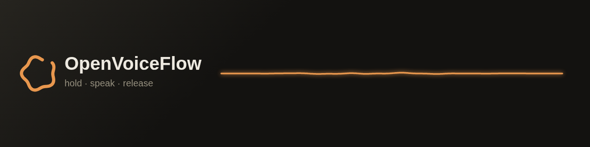

# OpenVoiceFlow

**Free, open-source voice dictation for macOS. Hold a key, talk, release — polished text lands in whatever app you're in. Your audio never leaves your Mac.**

[](https://openvoiceflow.com/download.html)
[](LICENSE)
[](https://github.com/shimoverse/openvoiceflow/releases)

People speak at roughly 150 words a minute and type at roughly 40. OpenVoiceFlow exists because closing that gap shouldn't cost $144 a year or require streaming your voice to someone's cloud. We think voice input should eventually be a default feature of every operating system; until it is, this is our contribution — and contributions are welcome.

## Install

**[Download the DMG](https://openvoiceflow.com/download.html)** — one universal build for Apple Silicon and Intel, Developer-ID signed and Apple-notarized. Drag it to Applications, open it, and a one-minute setup walks you through permissions and a speech-engine choice.

Requires macOS 14 (Sonoma) or newer. On macOS 12–13, the download page offers a retained legacy build.

## What it does

- **Push-to-talk dictation** — hold your chosen key (default: `fn`), speak, release. Text pastes at your cursor in any app.
- **On-device transcription** — [WhisperKit](https://github.com/argmaxinc/WhisperKit) runs Whisper locally, from `tiny` (39 MB) to `large-v3-turbo`. Audio is processed in memory and discarded; nothing is uploaded, nothing is recorded when the key isn't held.
- **Live feedback** — your words appear in the HUD as you speak, so you know it hears you.
- **Optional AI cleanup** — off by default (raw transcript, fully local). Turn it on to polish grammar and filler words via OpenRouter, OpenAI, Anthropic, Groq, or a fully-local Ollama model. Keys live in the macOS Keychain. Only cleaned *text* ever touches an API — never audio.
- **Personal dictionary, snippets, per-app styles** — teach it names and jargon once; spoken shortcuts expand to full text; casual in Slack, formal in Mail.
- **Auto-updates** — signed Sparkle updates from [openvoiceflow.com](https://openvoiceflow.com), verified with an EdDSA key pinned in the app.

No account. No telemetry. No paid tier — see [the mission](https://openvoiceflow.com/#mission).

## Build from source

You need a Mac on macOS 14+ with Xcode 16.4+ and [XcodeGen](https://github.com/yonaskolb/XcodeGen) (`brew install xcodegen`).

```bash
git clone https://github.com/shimoverse/openvoiceflow.git
cd openvoiceflow
bash native/scripts/run-local.sh
```

That generates the Xcode project from `native/project.yml`, builds an ad-hoc-signed debug app, and launches it. (Ad-hoc rather than unsigned, because macOS ties the Accessibility and Input Monitoring grants to a code signature — unsigned, the hotkey silently never fires.) For the signed + notarized release pipeline, see [`native/BUILD_RUNBOOK.md`](native/BUILD_RUNBOOK.md).

## How it's put together

Everything shipping lives in `native/Sources/OpenVoiceFlow/` — a small Swift/SwiftUI app with no storyboard and no dependencies beyond WhisperKit and Sparkle:

| Piece | File | Job |
|---|---|---|
| App + menu bar | `OpenVoiceFlowApp.swift` | `MenuBarExtra`, login item, Dock policy |
| State machine | `AppController.swift` | idle → recording → transcribing → cleaning → pasting |
| Hotkey | `HotkeyEngine.swift` | CGEvent tap; one key watched, everything else passes through |
| Audio | `AudioCapture.swift` | 16 kHz mono capture, level metering |
| Transcription | `Transcriber.swift` | WhisperKit lifecycle, model download, live partials |
| Cleanup | `CleanupProvider.swift` | the five backends behind one protocol |
| Paste | `Paster.swift` | ⌘V synthesis with clipboard restore |
| HUD | `HUDController.swift` | the floating waveform pill |
| Dashboard | `DashboardView.swift` | history, stats, dictionary, snippets, styles, settings |
| Onboarding | `OnboardingView.swift` | permissions, engine choice, first dictation |

The repo also contains the **legacy Python app** (`voiceflow/`, ≤ 0.3.6) that the native app replaced. It is end-of-life, receives no security fixes, and its defaults differ from current policy — kept only for reference and for the macOS 12–13 fallback build. Don't start there.

## Contributing

Start with [CONTRIBUTING.md](CONTRIBUTING.md). The short version: pull requests are welcome, CI compiles the Swift app and runs the website tests on every PR, and the maintainer reviews everything. Good first contributions: try the app and file honest bug reports, add an XCTest target (we want one), improve accuracy for your language.

## Privacy and security

The one-page version: audio on-device always; text to a cloud only if you enable cleanup; keys in the Keychain; no telemetry. Full statements: [PRIVACY.md](PRIVACY.md) · [SECURITY.md](SECURITY.md) · [threat model](docs/THREAT_MODEL.md). To report a vulnerability, see [SECURITY.md](SECURITY.md).

## License

[MIT](LICENSE) © Shimoverse Studios and contributors. Third-party notices: [docs/legal/THIRD_PARTY_NOTICES.md](docs/legal/THIRD_PARTY_NOTICES.md).
